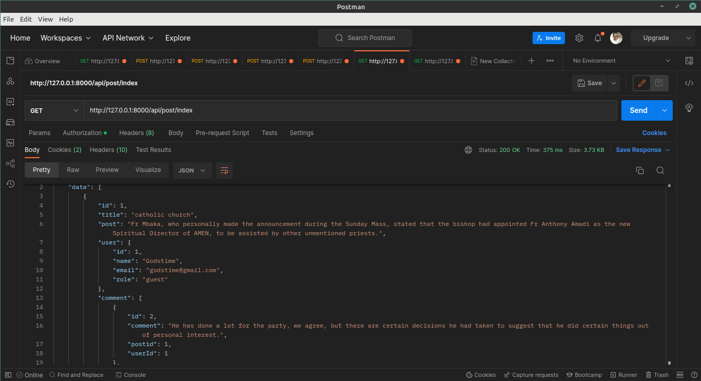
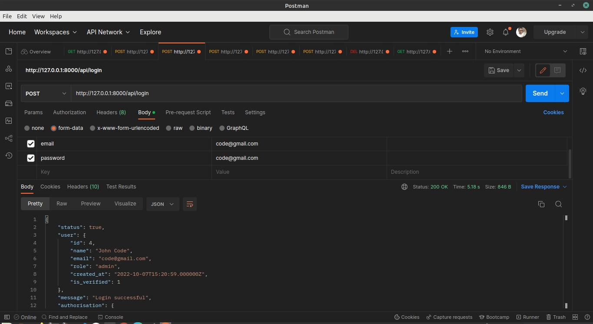
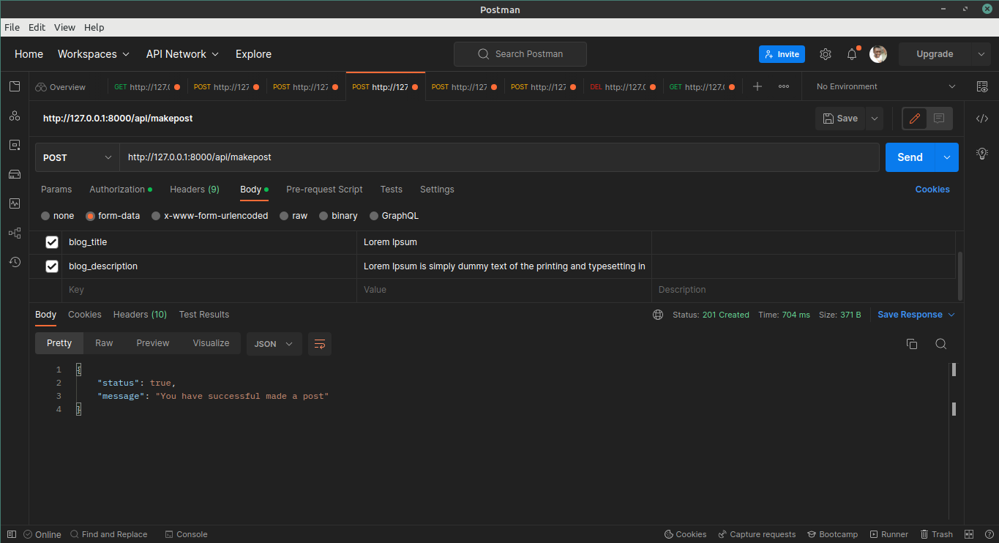

## BLOGWEB API LARAVEL
This project provides the following features:
- CRUD system
- Possible entities: ['admin','Posts','Comments','bloggers']
- Use a mailing library to send mail on registration.
- Use a mailing library to send in a forget password URL for resetting password
- Use JWT to authenticate every role based endpoint
- Use a solid principle design
# Database ERD
- https://drawsql.app/teams/godstime/diagrams/webblogapi

# Screenshot of some Endpoint
Dsipay All Post Endpoint            |  Login  Endpoint |  Make a Post Endpoint
:-------------------------:|:-------------------------:|:-------------------------:
  |   | 
